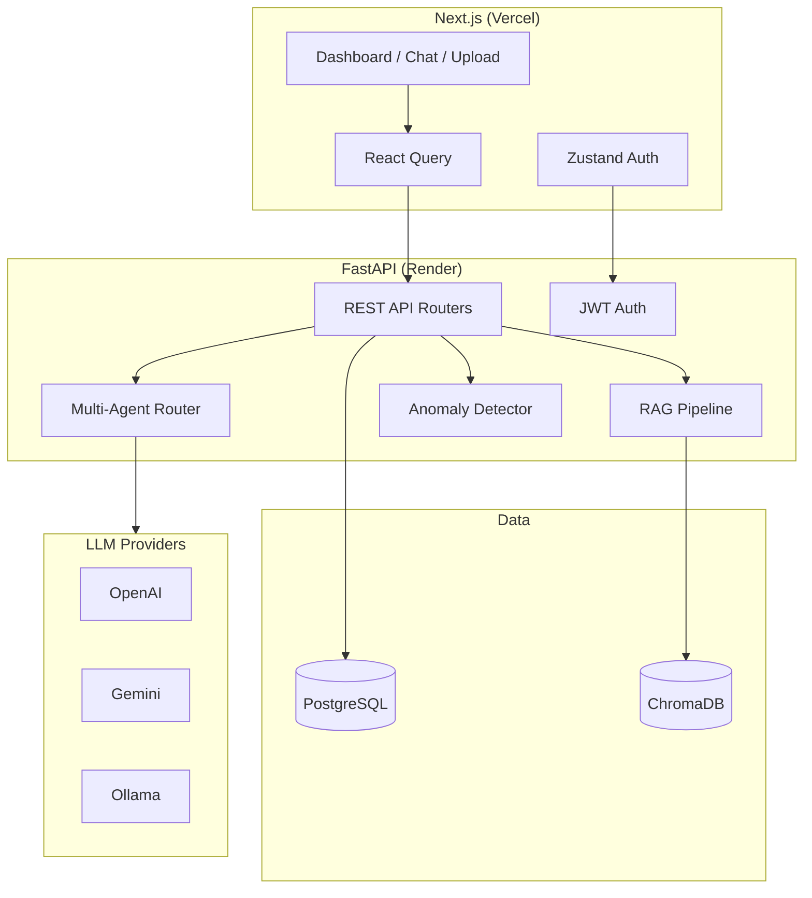

# AI SOC ANALYSIS SYSTEM

[](LICENSE)

Enterprise AI-powered Security Operations Center (SOC) assistant for cloud and enterprise security teams. Built for AI/GenAI engineering portfolios with production-style architecture.


## Features

| Feature | Description |
|---------|-------------|
| **Authentication** | JWT auth, role-based access (Admin, Security Analyst, Viewer) |
| **AI Chat** | Streaming ChatGPT-like assistant with RAG citations |
| **RAG Knowledge Base** | Upload PDF/DOCX/TXT/JSON → ChromaDB semantic search |
| **Log Analyzer** | Isolation Forest + rule-based detection + LLM summarization |
| **Incident Reports** | AI-generated reports with PDF/Markdown export |
| **SOC Dashboard** | Threat charts, risk score, AI alerts (Recharts) |
| **Multi-Agent AI** | Threat, Log, Compliance, Incident agents with routing |

## Tech Stack

**Frontend:** Next.js 15, TypeScript, Tailwind CSS, shadcn/ui, React Query, Zustand, Recharts

**Backend:** Python, FastAPI, SQLAlchemy, PostgreSQL, JWT

**AI:** LangChain, OpenAI / Gemini / Ollama, Hugging Face embeddings, ChromaDB

**ML:** Scikit-learn Isolation Forest

**Deploy:** Vercel (frontend) + Render (backend) + Docker Compose (local)

---

## Architecture



---

## Project Structure

```
AILLMENGINE/
├── frontend/                 # Next.js 15 app
│   ├── app/                  # Pages (login, dashboard, chat, ...)
│   ├── components/           # UI + layout + dashboard + chat
│   ├── services/             # API clients
│   ├── store/                # Zustand auth store
│   └── lib/                  # Utils + API helper
├── backend/
│   └── app/
│       ├── api/              # REST routers
│       ├── ai/               # LLM provider + agents
│       ├── rag/              # ChromaDB + embeddings
│       ├── ml/               # Anomaly detection
│       ├── auth/             # JWT dependencies
│       ├── models/           # SQLAlchemy models
│       └── services/         # Business logic
├── docker-compose.yml
└── README.md
```

---

## Quick Start (Docker)

### Prerequisites

- Docker & Docker Compose
- OpenAI API key (optional for full AI features)

### 1. Clone and configure

```bash
cd AILLMENGINE
cp backend/.env.example backend/.env
cp frontend/.env.example frontend/.env.local
```

Edit `backend/.env`:

```env
OPENAI_API_KEY=sk-your-key-here
LLM_PROVIDER=openai
SECRET_KEY=your-long-random-secret
```

### 2. Start services

```bash
docker-compose up --build
```

| Service | URL |
|---------|-----|
| Frontend | http://localhost:3000 |
| Backend API | http://localhost:8000 |
| API Docs | http://localhost:8000/docs |
| PostgreSQL | localhost:5432 |

### 3. Register and explore

1. Open http://localhost:3000/register
2. Create an account (Security Analyst role recommended)
3. Upload a document in **Upload Center**
4. Try **AI Chat** with security questions
5. Upload sample logs from `samples/logs/`
6. **Cloud Connect** — link AWS and stream live CloudTrail / CloudWatch logs

---

## Cloud Connect (Live Logs)

Connect your AWS account to stream **real-time** security logs into the SOC dashboard.

1. Open **Cloud Connect** in the sidebar (Admin / Security Analyst)
2. Enter connection name, region, Access Key ID, Secret Access Key
3. Choose **CloudTrail** (API activity) or **CloudWatch Logs** (requires log group name)
4. Click **Connect & verify** — credentials are encrypted at rest
5. Select the connection to see the **live log stream** (polls every ~8s)
6. Use **Fetch last 30 min & analyze** to run ML + AI on historical events

**IAM permissions (minimum):**
- CloudTrail: `cloudtrail:LookupEvents`, `sts:GetCallerIdentity`
- CloudWatch: `logs:FilterLogEvents`, `logs:DescribeLogGroups`, `sts:GetCallerIdentity`

High-severity live batches auto-create incidents and appear on the dashboard.

---

## Local Development (without Docker)

### Backend

```bash
cd backend
python -m venv venv
# Windows: venv\Scripts\activate
# macOS/Linux: source venv/bin/activate
pip install -r requirements.txt
cp .env.example .env
# Start PostgreSQL locally and set DATABASE_URL
uvicorn app.main:app --reload --port 8000
```

### Frontend

```bash
cd frontend
npm install
cp .env.example .env.local
npm run dev
```

---

## API Documentation

Base URL: `http://localhost:8000/api/v1`

Interactive docs: `http://localhost:8000/docs`

### Authentication

| Method | Endpoint | Description |
|--------|----------|-------------|
| POST | `/auth/register` | Register user |
| POST | `/auth/login` | Login → JWT token |
| GET | `/auth/me` | Current user (Bearer token) |

### Chat

| Method | Endpoint | Description |
|--------|----------|-------------|
| GET | `/chat/sessions` | List chat sessions |
| POST | `/chat/message` | Send message (RAG optional) |
| POST | `/chat/stream` | SSE streaming response |

### Documents & RAG

| Method | Endpoint | Description |
|--------|----------|-------------|
| POST | `/documents/upload` | Upload & index document |
| POST | `/documents/rag/query` | Semantic search + AI answer |

### Logs

| Method | Endpoint | Description |
|--------|----------|-------------|
| POST | `/logs/analyze` | Upload log file for ML + AI analysis |
| GET | `/logs/` | List analyzed logs |

### Reports

| Method | Endpoint | Description |
|--------|----------|-------------|
| POST | `/reports/generate` | Generate AI incident report |
| GET | `/reports/{id}/export/pdf` | Export PDF |
| GET | `/reports/{id}/export/markdown` | Export Markdown |

### Cloud

| Method | Endpoint | Description |
|--------|----------|-------------|
| POST | `/cloud/connect` | Connect AWS (encrypted credentials) |
| GET | `/cloud/connections` | List your cloud connections |
| DELETE | `/cloud/connections/{id}` | Remove a connection |
| GET | `/cloud/connections/{id}/logs` | Fetch recent logs + AI analysis |
| GET | `/cloud/connections/{id}/stream` | SSE live log stream |

### Dashboard

| Method | Endpoint | Description |
|--------|----------|-------------|
| GET | `/dashboard/stats` | Dashboard metrics & charts |

---

## Environment Variables

### Backend (`backend/.env`)

| Variable | Description | Default |
|----------|-------------|---------|
| `DATABASE_URL` | PostgreSQL async URL | local docker URL |
| `SECRET_KEY` | JWT signing key | (required in prod) |
| `LLM_PROVIDER` | `openai`, `gemini`, `ollama` | `openai` |
| `OPENAI_API_KEY` | OpenAI API key | — |
| `GEMINI_API_KEY` | Google Gemini key | — |
| `OLLAMA_BASE_URL` | Ollama server URL | `http://localhost:11434` |
| `CORS_ORIGINS` | Allowed frontend origins | `http://localhost:3000` |
| `CHROMA_PERSIST_DIR` | ChromaDB storage path | `./chroma_data` |

### Frontend (`frontend/.env.local`)

| Variable | Description |
|----------|-------------|
| `NEXT_PUBLIC_API_URL` | Backend API base URL |

---

## Deployment

### Frontend → Vercel

1. Push repo to GitHub
2. Import project in [Vercel](https://vercel.com)
3. Set root directory to `frontend`
4. Environment variable:
   ```
   NEXT_PUBLIC_API_URL=https://your-api.onrender.com/api/v1
   ```
5. Deploy

### Backend → Render

1. Create a **PostgreSQL** database on Render (free tier)
2. Create a **Web Service** from `backend/` directory
3. Use Docker or Python:
   - **Docker:** Use provided `Dockerfile`
   - **Start command:** `uvicorn app.main:app --host 0.0.0.0 --port $PORT`
4. Set environment variables from `backend/.env.example`
5. Set `DATABASE_URL` to Render Postgres internal URL (use `postgresql+asyncpg://...`)

See `backend/render.yaml` for Blueprint reference.

### Docker Production

```bash
docker-compose -f docker-compose.yml up -d
```

---

## Roles & Permissions

| Role | Upload Docs | Analyze Logs | Generate Reports | View Dashboard |
|------|:-----------:|:------------:|:----------------:|:--------------:|
| Admin | ✅ | ✅ | ✅ | ✅ |
| Security Analyst | ✅ | ✅ | ✅ | ✅ |
| Viewer | ❌ | ❌ | ❌ | ✅ |

---

## Screenshots

> Add screenshots after running the app:
> - Dashboard with threat charts
> - AI Chat with markdown responses
> - Log analysis results
> - Incident report generator

Place images in `docs/screenshots/` and reference them here.

---

## Sample Data

Try the included sample files:

- `samples/logs/cloudtrail_sample.json` — Failed logins + IAM activity
- `samples/docs/security_policy.txt` — Sample security policy for RAG

---

## License

This project is licensed under the MIT License — see the [LICENSE](LICENSE) file for details.

MIT — Portfolio and educational use.
